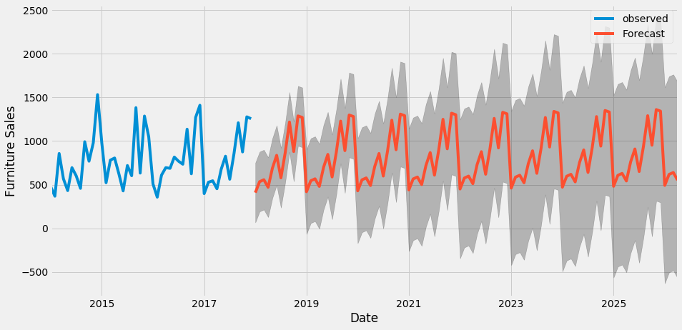

# Time-series-forecasting
Forecasting furniture sales using SARIMA model, tweaking p,d,q seasonal parameters and P,D,Q non seasonal parameters and choosing best parameters to fit the data

# Project Motivation

I implemented this project during early stages of my journey in time-series forecasting. My go-to reference guide was https://otexts.com/fpp2 which is an excellent resource for fundamental concepts and factors to consider while applying time-series forecasting. Through this project, I wanted to apply some of the concepts I learned.

# Problem Statement

Requirement is to forecast furniture sales at a monthly-level. In my experience, defining the problem requires critically thinking about the goals, what to forecast, what action can you take on forecasts and what is the time-horizon of the forecasts, among others. In this project, I am exploring the forecasting techniques and their parameter tuning.

I used Python's *statsmodel* library which has a comprehensive toolkit for forecasting.

# Approach

* Aggregate the data at monthly-level
* Explore time-series through trend, seasonality and noise decomposition
* Since a seasonal trend was observed, a SARIMA model would suit well
* Evaluate hyperparameters of the SARIMA model (seasonal and non-seasonal terms) according to AIC criteria
* Fit the model with best hyperparemeters and look at plot diagnostics (Residuals, Normal Q-Q) to ensure maximum signal is captured by the model
* Interpret the forecasts using RMSE. We got Sales RMSE=151 with Sales ranging from 400 to 1200, which is a reasonable fit
* Visualize the forecasts with 95% C.I. bands

# Results

